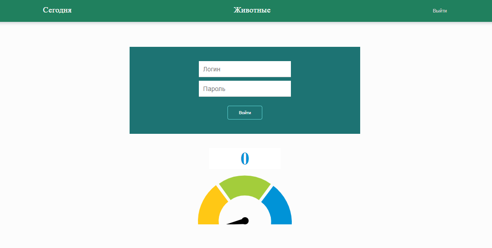
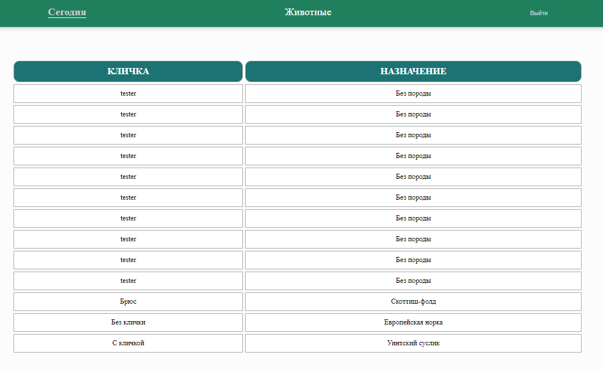
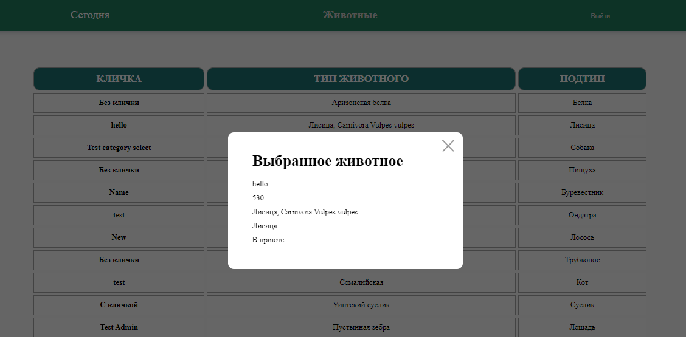
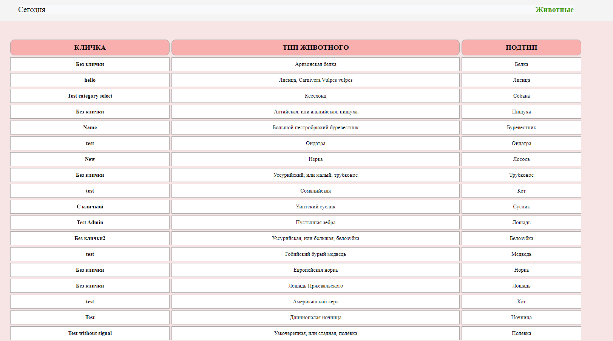
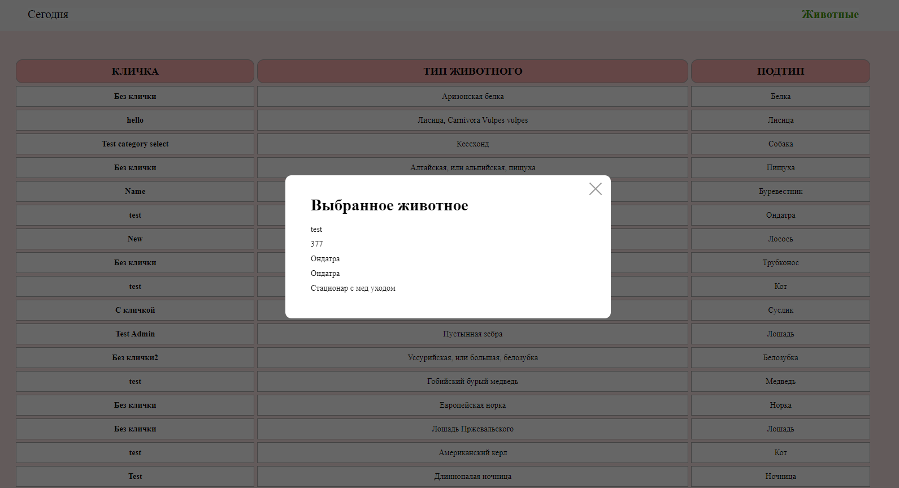

<h1 align="center">SPA_ANIMALS</h1>
<h2 align="center">

[](https://github.com/yTemnik/spa-animals)

</h2>

## Project setup


In terminal:
```
npm run start
```

# Screenshots

## Authorization
<p align="center">

</p>

## Authorisation Error
<p align="center">

</p>

## Today
<p align="center">

</p>

## Today Modal
<p align="center">

</p>

## Animals
<p align="center">

</p>

## Animals Modal
<p align="center">

</p>


